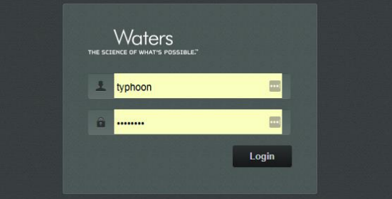
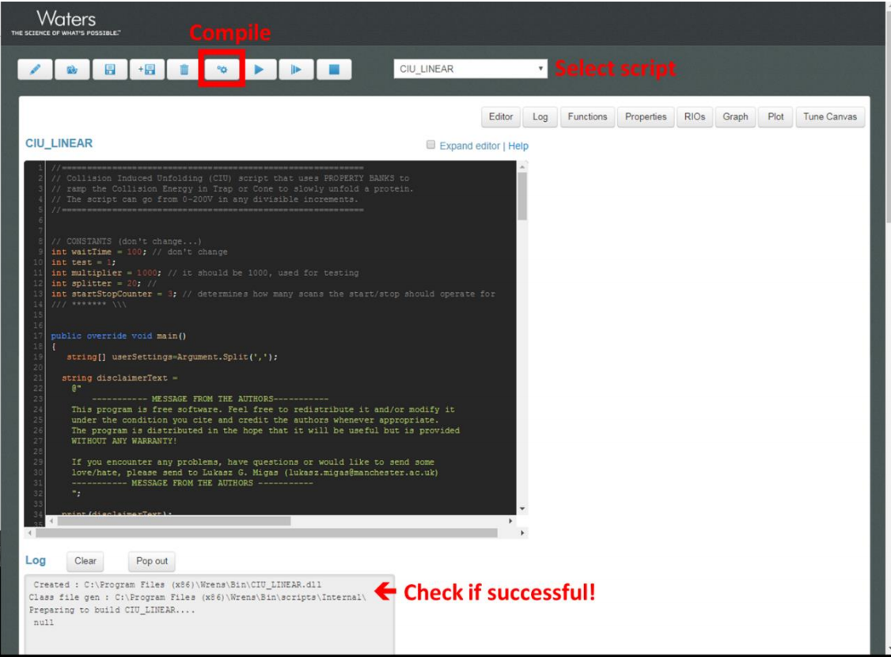

# How to compile ORIGAMI-MS (WREnS) scripts

1. Copy all `C#` scripts onto your instrument PC where you've previously installed WREnS. Typical location is `C:\Users\Administrator\Documents\Wrens\Scripts`

2. Start WREnS from the Start menu (Start -> WREnS). A new browser window/tab should open which looks something like this
3. Login and select a script to compile
4. Compile the script using the compile button. Repeat the action for each file.
5. If all went well, the log at the bottom of the screen should say _Created: C:\..._
6. If it doesn't work, let me know by email (see [contact](../main/about.md))

!!! Note
    If you copied the scripts into the folder after you've opened WREnS, you might have to refresh the window or restart WREnS.
